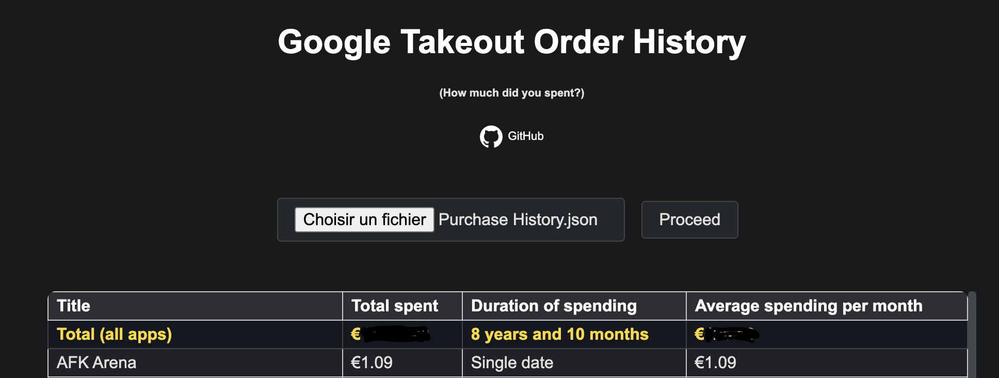

# [Access to the github-page](https://rdyx.github.io/google-takeout-order-history/)
---

Simple application (web page) that show in a very basic <table> how much you spent for each application in your google play account.

You will need to get the `Purchase History.json` file from [Google Takeout](https://takeout.google.com/)

The file must follow the same format as in the `example.json` file (which is itself extracted from `Purchase History.json`)

- Unselected everything
- Scroll down to find "Google Play store"
- Tick the checkbox next to "Google Play Store"
- Scroll down up to the next step button
- Select stuff as you want (the file should not be huge depending on how much you're spending and how old you account is. I.E mine was around 1Mo for several purchases and multiple years history)
- Wait a bit an email from google that will tell you your file is ready
- Download it
- Put the `Purchase History.json` file in the file input
- Click "Proceed"
- Here you go, there's your table containing your history
